# Golf Tracker — Implementation Plan

## Goal

Build the MVP of a native Android golf stat tracking app using Kotlin, Jetpack Compose, Room, and Hilt. The app supports per-hole stat tracking during rounds, course/bag management, handicap calculation (9- and 18-hole), a stats dashboard, and CSV export. The data model is future-proofed for per-shot and GPS tracking.

---

## Implementation Phases

Implementation is broken into 7 phases, each building on the previous. Each phase results in a testable increment.

```mermaid
gantt
    title Implementation Phases
    dateFormat X
    axisFormat %s
    section Phases
    1 - Project Setup       :done, p1, 0, 1
    2 - Data Layer           :p2, 1, 2
    3 - Course Management    :p3, 2, 3
    4 - Round Tracking       :p4, 3, 5
    5 - Stats Dashboard      :p5, 5, 6
    6 - Handicap & Scoring   :p6, 6, 7
    7 - CSV Export            :p7, 7, 8
```



---

## Phase 1 — Project Setup

### Steps
1. Create a new Android project via Android Studio's **Empty Compose Activity** template
2. Configure Gradle (Kotlin DSL) with all dependencies
3. Set up package structure
4. Confirm build + emulator launch

### Project Structure

```
app/src/main/java/com/golftracker/
├── GolfTrackerApp.kt                  # @HiltAndroidApp Application class
├── MainActivity.kt                    # Single-activity entry point
├── navigation/
│   └── NavGraph.kt                    # Compose NavHost + route definitions
├── data/
│   ├── db/
│   │   ├── GolfDatabase.kt            # Room database holder
│   │   ├── Converters.kt              # Type converters (Date, enums)
│   │   └── dao/
│   │       ├── CourseDao.kt
│   │       ├── RoundDao.kt
│   │       ├── HoleStatDao.kt
│   │       ├── ClubDao.kt
│   │       ├── PuttDao.kt
│   │       └── PenaltyDao.kt
│   ├── entity/
│   │   ├── Course.kt
│   │   ├── TeeSet.kt
│   │   ├── Hole.kt
│   │   ├── HoleTeeYardage.kt
│   │   ├── Club.kt
│   │   ├── Round.kt
│   │   ├── HoleStat.kt
│   │   ├── Putt.kt
│   │   ├── Penalty.kt
│   │   └── Shot.kt                    # Post-MVP, schema only
│   ├── repository/
│   │   ├── CourseRepository.kt
│   │   ├── RoundRepository.kt
│   │   ├── ClubRepository.kt
│   │   └── StatsRepository.kt
│   └── model/
│       ├── ShotOutcome.kt             # Enum: ON_TARGET, MISS_LEFT, etc.
│       ├── ApproachLie.kt             # Enum: TEE, FAIRWAY, ROUGH, SAND, OTHER
│       └── PenaltyType.kt             # Enum: WATER, OB, LOST_BALL, etc.
├── di/
│   └── DatabaseModule.kt              # Hilt @Module providing DB + DAOs
├── ui/
│   ├── theme/
│   │   ├── Theme.kt
│   │   ├── Color.kt
│   │   └── Type.kt
│   ├── components/
│   │   ├── NumberStepper.kt
│   │   ├── ChipSelector.kt
│   │   ├── StatCard.kt
│   │   └── ConfirmDialog.kt
│   ├── home/
│   │   ├── HomeScreen.kt
│   │   └── HomeViewModel.kt
│   ├── course/
│   │   ├── CourseListScreen.kt
│   │   ├── CourseDetailScreen.kt
│   │   ├── CourseEditScreen.kt
│   │   └── CourseViewModel.kt
│   ├── bag/
│   │   ├── BagScreen.kt
│   │   └── BagViewModel.kt
│   ├── round/
│   │   ├── RoundSetupScreen.kt
│   │   ├── HoleTrackingScreen.kt
│   │   ├── RoundSummaryScreen.kt
│   │   ├── RoundHistoryScreen.kt
│   │   ├── RoundViewModel.kt
│   │   └── RoundHistoryViewModel.kt
│   ├── stats/
│   │   ├── StatsDashboardScreen.kt
│   │   ├── StatsDetailScreen.kt
│   │   └── StatsViewModel.kt
│   └── handicap/
│       ├── HandicapScreen.kt
│       └── HandicapViewModel.kt
└── util/
    ├── HandicapCalculator.kt
    ├── GirCalculator.kt
    └── CsvExporter.kt
```

### Key Dependencies (pinned versions)

```kotlin
// build.gradle.kts (app module) — key dependencies
plugins {
    id("com.android.application")
    id("org.jetbrains.kotlin.android")
    id("com.google.devtools.ksp")
    id("com.google.dagger.hilt.android")
    id("org.jetbrains.kotlin.plugin.compose")
}

android {
    compileSdk = 35
    defaultConfig {
        minSdk = 26
        targetSdk = 35
    }
}

dependencies {
    // Compose BOM
    val composeBom = platform("androidx.compose:compose-bom:2024.12.01")
    implementation(composeBom)
    implementation("androidx.compose.ui:ui")
    implementation("androidx.compose.material3:material3")
    implementation("androidx.compose.ui:ui-tooling-preview")
    implementation("androidx.activity:activity-compose:1.9.3")
    implementation("androidx.lifecycle:lifecycle-viewmodel-compose:2.8.7")
    implementation("androidx.navigation:navigation-compose:2.8.5")

    // Room
    val roomVersion = "2.6.1"
    implementation("androidx.room:room-runtime:$roomVersion")
    implementation("androidx.room:room-ktx:$roomVersion")
    ksp("androidx.room:room-compiler:$roomVersion")

    // Hilt
    val hiltVersion = "2.51.1"
    implementation("com.google.dagger:hilt-android:$hiltVersion")
    ksp("com.google.dagger:hilt-android-compiler:$hiltVersion")
    implementation("androidx.hilt:hilt-navigation-compose:1.2.0")

    // Charts
    implementation("com.patrykandpatrick.vico:compose-m3:2.0.0-beta.3")

    // CSV
    implementation("com.opencsv:opencsv:5.9")
}
```

> [!NOTE]
> Exact versions will be confirmed against the latest BOM/catalog at implementation time. These are current stable versions as of early 2025.

---

## Phase 2 — Data Layer

### Room Entities

Create all entity classes matching the ER diagram from [requirements.md](file:///Users/bveber/antigravity/golf_tracker/requirements.md). Key design decisions:

| Entity | Notes |
|---|---|
| `Course` | `id`, `name`, `city`, `state`, `holeCount` (9 or 18) |
| `TeeSet` | FK to `Course`, `name`, `slope`, `rating` |
| `Hole` | FK to `Course`, `holeNumber`, `par`, `handicapIndex` |
| `HoleTeeYardage` | Junction: `holeId` + `teeSetId` → `yardage` |
| `Club` | `name`, `type` (DRIVER, IRON, WEDGE, PUTTER, etc.) |
| `Round` | FK to `Course` + `TeeSet`, `date`, `notes`, `finalized`, `holesPlayed` (9/18) |
| `HoleStat` | FK to `Round` + `Hole`, all per-hole stats including `approachLie`, `sandSave`, `girOverride` |
| `Putt` | FK to `HoleStat`, `puttNumber`, `distance` (nullable), `made` |
| `Penalty` | FK to `HoleStat`, `type` (enum), `strokes` |
| `Shot` | FK to `HoleStat`, post-MVP — schema created, not populated |

### DAOs

Each DAO provides:
- Insert/update/delete
- Queries with `Flow<>` return types for reactive UI
- Key joins (e.g., `RoundDao` returns `Round` with `Course` name, `HoleStat` list)

### Repositories

Thin wrappers around DAOs. Repositories handle:
- Multi-DAO transactions (e.g., saving a full hole stat with putts + penalties)
- Business logic like GIR auto-calculation

### Hilt Module

`DatabaseModule.kt` provides singleton `GolfDatabase` instance and all DAO bindings.

---

## Phase 3 — Course Management UI

### Screens

#### CourseListScreen
- Lists all courses with name, city, hole count
- FAB to add new course
- Swipe-to-delete with confirmation

#### CourseEditScreen
- Form: name, city, state, hole count (9/18 toggle)
- Tee set management: add/remove tee sets with name, slope, rating
- Per-hole editor: par, yardage (per tee set), handicap index
- Save validates all required fields

#### BagScreen
- List clubs in bag with name and type
- Add/edit/delete clubs
- Pre-populated with common set (Driver, 3W, 5i–PW, 52°, 56°, 60°, Putter)

---

## Phase 4 — Round Tracking Flow (largest phase)

### Screens

#### RoundSetupScreen
- Select course from list (or quick-create)
- Select tee set
- Date picker (default: today)
- Optional notes
- "Start Round" button → navigates to hole 1

#### HoleTrackingScreen
This is the core input screen, used during play. Design priorities: **quick, thumb-friendly, minimal scrolling**.

Layout (scrollable column):
1. **Header**: Hole #, Par, Yardage — with prev/next navigation
2. **Score**: Number stepper (large)
3. **Tee Shot Section** (hidden on par 3):
   - Outcome chips: On-target · Miss L · Miss R · Short · Long
   - In-trouble toggle
   - Club picker (dropdown or bottom sheet)
4. **Approach Section**:
   - Lie chips: Tee · Fairway · Rough · Sand · Other
   - Outcome chips: On-target · Miss L · Miss R · Short · Long
   - Club picker
5. **Green & Short Game**:
   - GIR (auto-calculated, toggleable override)
   - Near-GIR toggle
   - Chips stepper
   - Up-and-down toggle
   - Sand save toggle (visible only if approach lie = Sand or chips > 0)
6. **Putting**:
   - Putts stepper
   - Dynamic putt distance fields (one per putt, based on stepper count)
7. **Penalties**:
   - Add penalty button → type picker + strokes
   - List of penalties with delete

**Par-3 logic**: When hole par = 3, the tee shot section is hidden. The approach section's lie is auto-set to "Tee" and club defaults to the tee shot club field.

**GIR auto-calc**: `score - putts <= par - 2` → GIR = true. User can override.

#### RoundSummaryScreen
- Scrollable scorecard-style table showing all holes
- Per-hole: score, vs par, GIR, putts, penalties
- Totals row
- Tap hole → edit (navigates back to HoleTrackingScreen)
- "Finalize Round" button

#### RoundHistoryScreen
- Lists past rounds: date, course, score, vs par
- Tap → view summary
- Export CSV action

---

## Phase 5 — Stats Dashboard

#### StatsDashboardScreen

Top-level dashboard with filter bar (course, date range, tee set) and category tabs:

| Tab | Stats |
|---|---|
| **Driving** | Fairways hit %, miss direction pie chart |
| **Approach** | GIR %, near-GIR %, miss direction pie chart |
| **Short Game** | Scrambling %, up-and-down %, sand save %, avg chips, greenside aggregate |
| **Putting** | Putts/round, putts/GIR, avg first putt dist, total feet made, 1-putt %, make % by distance bucket |
| **Scoring** | Avg score, avg vs par, score distribution bar chart |
| **Penalties** | Frequency, type breakdown pie chart |

Each stat category also has a **trend line chart** (Vico) showing the stat over time (per round).

`StatsRepository` computes all aggregates via Room SQL queries where possible, with Kotlin post-processing for complex metrics like distance buckets.

---

## Phase 6 — Handicap & Scoring

#### HandicapCalculator

WHS calculation logic:
1. Collect all finalized rounds
2. Compute differential per round: `(113 / slope) × (adjusted gross score − rating)`
3. For 9-hole rounds: pair consecutive 9-hole scores chronologically to form 18-hole differentials
4. Take best 8 of last 20 differentials
5. Average × 0.96 = handicap index

#### HandicapScreen
- Current handicap index (large display)
- Differential history list (most recent 20)
- Trend chart (handicap over time)

---

## Phase 7 — CSV Export

#### CsvExporter
- **Round export**: One row per hole, columns for all stat fields + putt distances + penalties
- **Aggregate export**: Summary stats matching dashboard
- Uses OpenCSV for generation
- Writes to app cache, then shares via Android `ShareSheet` (Intent.ACTION_SEND) or saves to user-selected location via `SAF` (Storage Access Framework)

---

## Verification Plan

### Automated Tests

#### Unit Tests (JVM)
- `HandicapCalculator` — test WHS formula, 9-hole pairing, edge cases (< 20 rounds, no rounds)
- `GirCalculator` — test auto-calc logic for par 3/4/5 with various stroke/putt combos
- `CsvExporter` — test output format, column headers, special characters

```bash
# Run unit tests
./gradlew test
```

#### Instrumented Tests (Android)
- **Room DAO tests** — insert/query/update/delete for all entities; verify FK constraints and cascading deletes
- **Repository tests** — verify transactions (e.g., saving HoleStat + Putts + Penalties atomically)

```bash
# Run instrumented tests on connected emulator
./gradlew connectedAndroidTest
```

### Android Emulator Setup on macOS

> [!IMPORTANT]
> Android Studio is strongly recommended — it bundles the SDK, emulator, and AVD manager. You can also set up command-line-only, but the Android Studio approach is far simpler.

#### Option A: Android Studio (Recommended)

1. **Install Android Studio**
   ```bash
   brew install --cask android-studio
   ```

2. **First launch setup**
   - Open Android Studio → Accept licenses
   - SDK Manager → install **Android SDK 35** (or latest), **SDK Build-Tools**, **SDK Platform-Tools**
   - Go to SDK Manager → SDK Tools tab → ensure **Android Emulator** is checked
   - On Apple Silicon Macs the hypervisor is built-in; on Intel Macs install **Intel HAXM**

3. **Create an AVD (Android Virtual Device)**
   - Tools → Device Manager → **Create Virtual Device**
   - Select **Pixel 7** (or any phone)
   - Select **API 35** system image (download if needed)
   - Finish — name it `Pixel_7_API_35`

4. **Launch emulator**
   - Click the ▶ button next to the AVD in Device Manager
   - Or from terminal:
     ```bash
     ~/Library/Android/sdk/emulator/emulator -avd Pixel_7_API_35
     ```

5. **Run the app**
   - Open the `golf_tracker` project in Android Studio
   - Select your AVD from the device dropdown
   - Click ▶ (Run) — builds + installs + launches on emulator

#### Option B: Command-Line Only

1. **Install command-line tools**
   ```bash
   brew install --cask android-commandlinetools
   ```

2. **Install SDK components**
   ```bash
   export ANDROID_HOME=~/Library/Android/sdk
   sdkmanager "platform-tools" "platforms;android-35" "build-tools;35.0.0" \
              "emulator" "system-images;android-35;google_apis;arm64-v8a"
   ```

3. **Create AVD**
   ```bash
   avdmanager create avd -n Pixel_7_API_35 -k "system-images;android-35;google_apis;arm64-v8a" -d pixel_7
   ```

4. **Launch emulator**
   ```bash
   $ANDROID_HOME/emulator/emulator -avd Pixel_7_API_35
   ```

5. **Build and install**
   ```bash
   cd /Users/bveber/antigravity/golf_tracker
   ./gradlew installDebug
   adb shell am start -n com.golftracker/.MainActivity
   ```

### Manual Testing Checklist

After all phases are built, run through this end-to-end on the emulator:

| # | Step | What to verify |
|---|---|---|
| 1 | **Add clubs** — Create a standard bag (Driver, 3W, 7i, PW, 56°, Putter) | Clubs appear in bag list |
| 2 | **Create course** — "Test Course", 18 holes, 2 tee sets | Course saved with all hole data |
| 3 | **Play a round** — Enter stats for all 18 holes | All fields save correctly |
| 3a | Include a **par 3** | Tee shot section hidden, approach lie = "Tee" |
| 3b | Include a **sand save** | Sand save toggle visible and saves |
| 3c | Include **penalties** (water + OB) | Penalties listed, penalty strokes auto-counted |
| 3d | Include a **3-putt** with all distances entered | All 3 putt distances saved |
| 3e | Include a hole with **no putt distance** | Stats later show 3 ft default |
| 4 | **Review & edit** — Open round summary, tap a hole, change score, save | Edit persists |
| 5 | **Finalize** — Mark round as finalized | Round shows as finalized |
| 6 | **Stats dashboard** — Check all tabs | Numbers match expected values |
| 7 | **Second round** — Play a **9-hole** round | Saved as 9-hole round |
| 8 | **Handicap** — View handicap screen | Differential calculated correctly |
| 9 | **CSV export** — Export round | File opens correctly with all columns |
