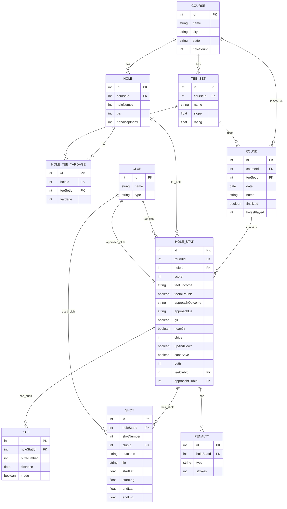
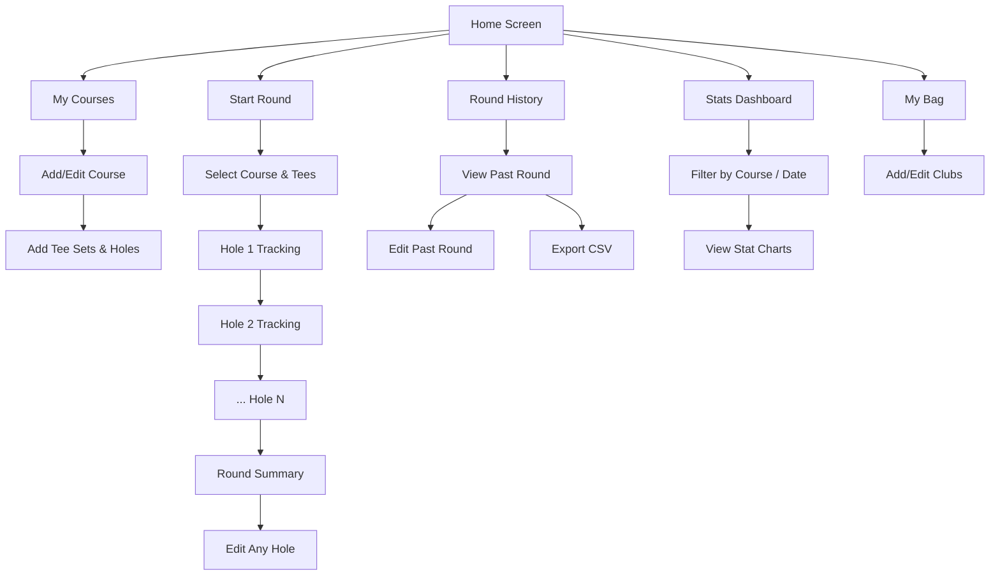

# Golf Tracker — Requirements Document

## Overview

A native Android app for personal golf stat tracking. The app allows a golfer to record detailed per-hole statistics during a round, review and edit data afterward, track handicap over time, and export data as CSV. The data model is designed to accommodate future per-shot tracking and GPS functionality.

---

## MVP Scope

### 1. Course Management

| Feature | Detail |
|---|---|
| **Create course** | Name, city/state, number of holes (9 or 18) |
| **Tee sets** | Each course has one or more tee sets (e.g., "Blue", "White") with slope, rating, and per-hole yardage |
| **Hole data** | Par, yardage (per tee set), handicap index for each hole |
| **Edit/delete** | Full CRUD on courses |

### 2. Round Setup

- Select or create a course
- Choose a tee set
- Record date (auto-filled, editable)
- Optional notes field

### 3. Hole-by-Hole Tracking (MVP)

For **each hole** during a round the user records:

| Stat | Input Type | Values / Notes |
|---|---|---|
| **Score** | Number stepper | Total strokes |
| **Tee shot outcome** | Single-select | On-target · Miss Left · Miss Right · Short · Long |
| **Tee shot in trouble** | Toggle | Yes / No |
| **Approach shot outcome** | Single-select | On-target · Miss Left · Miss Right · Short · Long |
| **Approach lie** | Single-select | Tee · Fairway · Rough · Sand · Other |
| **Green in Regulation** | Auto-calculated | Reached green in ≤ (par − 2) strokes; user can override |
| **Near-GIR** | Toggle | Missed green but close (fringe / just off) |
| **Hazards / Penalties** | Multi-select | Water · OB · Lost Ball · Unplayable · Other |
| **Penalty strokes** | Number stepper | Auto-incremented per penalty, editable |
| **Number of chips** | Number stepper | 0+ (greenside shots, all lies) |
| **Up & down** | Toggle | Converted up-and-down? (from any lie) |
| **Sand save** | Toggle | Converted up-and-down specifically from sand |
| **Number of putts** | Number stepper | 0+ |
| **Putt distances** | Number inputs | Distance in feet for each putt (e.g., putt 1: 25 ft, putt 2: 4 ft) |
| **Club used (tee shot)** | Picker | From user's bag (see §4) |
| **Club used (approach)** | Picker | From user's bag |

> [!NOTE]
> **Par-3 behavior:** On par-3 holes the tee shot *is* the approach. The app auto-maps the tee shot into the approach fields and sets the approach lie to "Tee". The user only fills in one shot section; tee-shot-specific fields (outcome, in-trouble) are hidden for par 3s.

### 4. Club / Bag Management

- User defines their bag (e.g., Driver, 3W, 5i–PW, 52°, 56°, 60°, Putter)
- Clubs are reusable across rounds
- Club picker appears in hole tracking for tee shot and approach

### 5. Post-Round Review & Edit

- After completing a round, user can review all hole data in a scrollable summary
- Tap any hole to edit its stats
- Mark round as "finalized" when done editing

### 6. Scoring & Handicap

| Feature | Detail |
|---|---|
| **Stroke total** | Auto-summed from per-hole scores |
| **Score vs. par** | Displayed per hole and total |
| **9-hole rounds** | Supported — two 9-hole differentials are combined into one 18-hole differential per WHS rules |
| **Handicap index** | Calculated from most recent 20 (18-hole equivalent) differentials using WHS formula |
| **Handicap history** | Track index over time |

> [!NOTE]
> WHS uses the best 8 of the last 20 differentials. Differential = (113 / slope) × (adjusted gross score − course rating). For 9-hole rounds, two consecutive 9-hole scores are paired to form one 18-hole differential.

### 7. Statistics Dashboard

Post-round and aggregate stats including:

- **Driving**: Fairways hit %, miss direction distribution
- **Approach**: GIR %, near-GIR %, approach miss direction distribution
- **Short game**: Scrambling %, up-and-down %, sand save %, avg chips per round, greenside aggregate (all chip/pitch/sand stats combined)
- **Putting**: Putts per round, putts per GIR, avg first putt distance, avg total putt distance, 1-putt %, make % by distance bucket, total feet of putts made (assumes 3 ft for untracked distances)
- **Scoring**: Avg score, avg vs par, eagles/birdies/pars/bogeys/doubles+ distribution
- **Penalties**: Penalty frequency, penalty type breakdown
- **Trends**: All of the above charted over time (line graphs)
- **Filters**: By course, date range, tee set

### 8. CSV Export

- Export full round data (one row per hole, all stat columns)
- Export aggregate stats summary
- Share via Android share sheet or save to device storage

### 9. Offline Support

- All data stored locally using Room (SQLite)
- App is fully functional with no network connectivity
- No cloud sync in MVP

---

## Post-MVP Features

### Per-Shot Tracking

- Log each shot individually within a hole (shot 1, shot 2, …)
- Each shot records: club, outcome, lie, and (eventually) GPS coordinates
- Hole summary stats auto-calculated from shot-level data

### GPS Shot Tracking

- Record lat/lng at address and landing of each shot
- Estimate shot distance from GPS coordinates
- Visualize shots on a map overlay

> [!IMPORTANT]
> **GPS course data (tee/green locations):** Most commercial apps (Arccos, Golfshot, 18Birdies) license their course map data from providers like **Golf Logix** or maintain proprietary databases. Open alternatives include:
> - **OpenStreetMap** — Some courses have greens/tees mapped, but coverage is spotty.
> - **Manual pin-drop** — User marks tee and green locations on a satellite map (Google Maps SDK) during first play, then reuses.
> - **Community-sourced** — Users contribute course layouts that other users can download.
>
> **Recommended MVP approach for GPS:** Start with user-placed pin drops on a satellite view. No external data license needed. Revisit community-sourcing or OSM later.

### Course Data Scraping

- Script to scrape scorecard data (par, yardage, slope, rating) from public sources
- Populate the local course database from scraped data

### Cloud Sync & Multi-Device

- Sync round data to a cloud backend (Firebase / Supabase)
- Access from multiple devices

---

## Data Model (High-Level)

Designed to support both MVP (per-hole) and future (per-shot) tracking.

> [!NOTE]
> The `SHOT` table is for post-MVP per-shot tracking. It will be created in the schema from the start but not populated until that feature is built.

---

## UX Flow (MVP)

---

## Technical Stack (MVP)

| Layer | Technology |
|---|---|
| Language | Kotlin |
| UI | Jetpack Compose |
| Architecture | MVVM + Repository pattern |
| Local DB | Room (SQLite) |
| DI | Hilt |
| Navigation | Compose Navigation |
| Charts | Vico or MPAndroidChart |
| CSV Export | opencsv or custom writer |
| Build | Gradle (Kotlin DSL) |

---

## Resolved Decisions

| # | Question | Decision |
|---|---|---|
| 1 | **9-hole handicap** | Supported — two 9-hole differentials combine into one 18-hole differential per WHS rules |
| 2 | **Par-3 tee shot** | Auto-maps to approach; lie set to "Tee"; tee-shot fields hidden on par 3s |
| 3 | **Sand saves** | Tracked as a separate toggle; up-and-down remains for all lies; dashboard can aggregate all greenside stats |
| 4 | **GIR calculation** | Auto-calculated: reached green in ≤ (par − 2) strokes; user can override |
